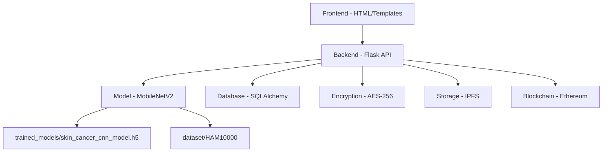
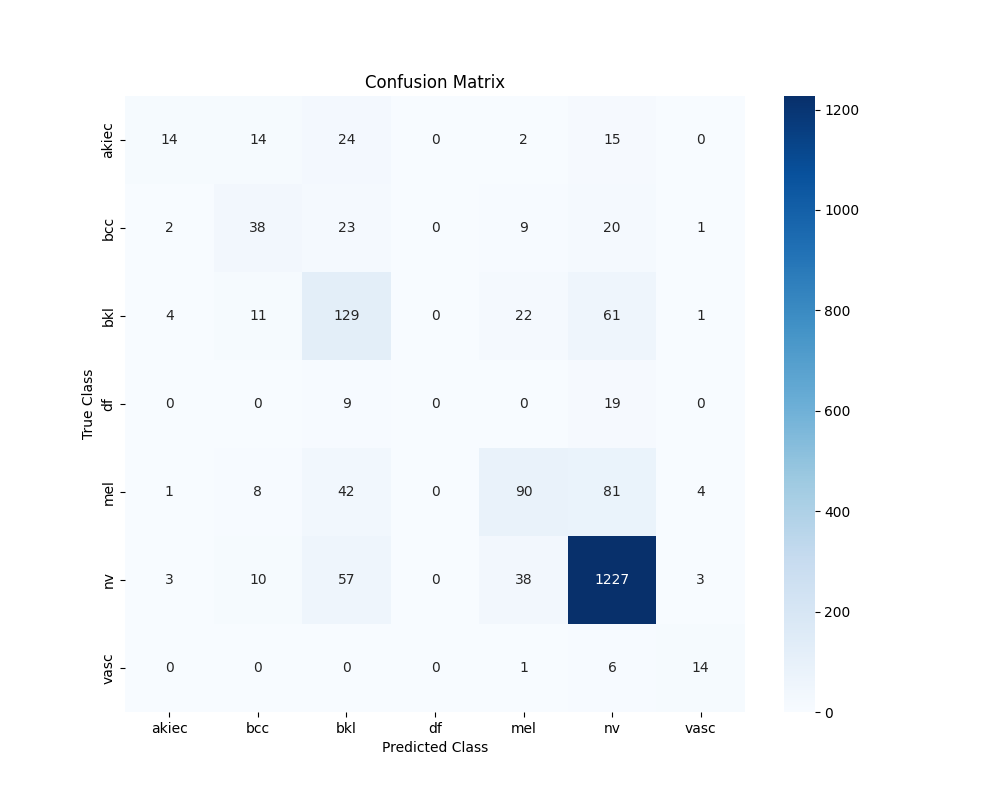

# Skin Disease Detection — Project Analysis & Model Test Results

## Project Architecture

The project is a **full-stack AI skin disease detection platform** with blockchain-secured image storage:

| Component | Key Files |
|-----------|-----------|
| Model architecture | [model.py](file:///c:/skin_project/model/model.py) — MobileNetV2 + custom head |
| Training pipeline | [train.py](file:///c:/skin_project/model/train.py) — ImageDataGenerator, 224×224, batch 32 |
| Preprocessing | [preprocess.py](file:///c:/skin_project/model/preprocess.py) — MobileNetV2 `preprocess_input` |
| Prediction service | [predict.py](file:///c:/skin_project/model/predict.py) — [SkinDiseasePredictor](file:///c:/skin_project/model/predict.py#26-93) class |
| Web application | [app.py](file:///c:/skin_project/backend/app.py) — Flask routes with auth, upload, verify |
| Class labels | [class_labels.json](file:///c:/skin_project/model/class_labels.json) — 7 disease mappings |

### Dataset: HAM10000
- **10,015 dermatoscopic images** across 7 diagnostic categories
- Split: **80% training / 20% validation** (shuffled with `random_state=42`)
- Validation set: **2,003 samples**

---

## Model Test Results

Ran [test_accuracy.py](file:///c:/skin_project/model/test_accuracy.py) from the project root:

### Overall Metrics

| Metric | Value |
|--------|-------|
| **Validation Accuracy** | **75.49%** |
| **Validation Loss** | 0.7026 |
| **Total Test Samples** | 2,003 |

### Per-Class Performance

| Class | Full Name | Precision | Recall | F1-Score | Support |
|-------|-----------|-----------|--------|----------|---------|
| **nv** | Melanocytic nevi | 0.86 | 0.92 | 0.89 | 1,338 |
| **vasc** | Vascular lesions | 0.61 | 0.67 | 0.64 | 21 |
| **bkl** | Benign keratosis | 0.45 | 0.57 | 0.50 | 228 |
| **mel** | Melanoma | 0.56 | 0.40 | 0.46 | 226 |
| **bcc** | Basal cell carcinoma | 0.47 | 0.41 | 0.44 | 93 |
| **akiec** | Actinic keratoses | 0.58 | 0.20 | 0.30 | 69 |
| **df** | Dermatofibroma | 0.00 | 0.00 | 0.00 | 28 |

### Confusion Matrix

---

## Key Observations

> [!WARNING]
> **Dermatofibroma (df)** has 0% precision/recall — the model completely fails on this class (only 28 samples in validation).

> [!IMPORTANT]
> **Melanoma (mel)** has only **40% recall** — 60% of melanoma cases are being missed. This is clinically dangerous for a skin cancer detection tool.

1. **Class imbalance is the primary issue**: [nv](file:///c:/skin_project/.env) (melanocytic nevi) dominates with 1,338 samples (67% of validation set), while `df` has only 28 and `vasc` only 21. The model is biased toward predicting [nv](file:///c:/skin_project/.env).

2. **nv performs well** (F1=0.89) because it has enormous training support — but at the cost of other classes.

3. **Macro avg F1 is only 0.46**, indicating poor balanced performance despite the 75.5% headline accuracy.

## Recommendations to Improve

1. **Class weights** — Use `class_weight='balanced'` in `model.fit()` to penalize majority-class misclassification
2. **Oversampling** — Use SMOTE or random oversampling for minority classes (`df`, `vasc`, `akiec`)  
3. **Fine-tuning** — Unfreeze the last few MobileNetV2 layers (`base_model.trainable = True` for top layers)
4. **More epochs** — Currently limited to 10 epochs; allow 20–30 with early stopping
5. **Focal loss** — Replace `categorical_crossentropy` with focal loss to focus on hard-to-classify samples

---

*Results saved to [model/eval_outputs/](file:///c:/skin_project/model/eval_outputs)*
